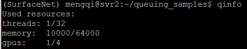
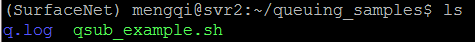
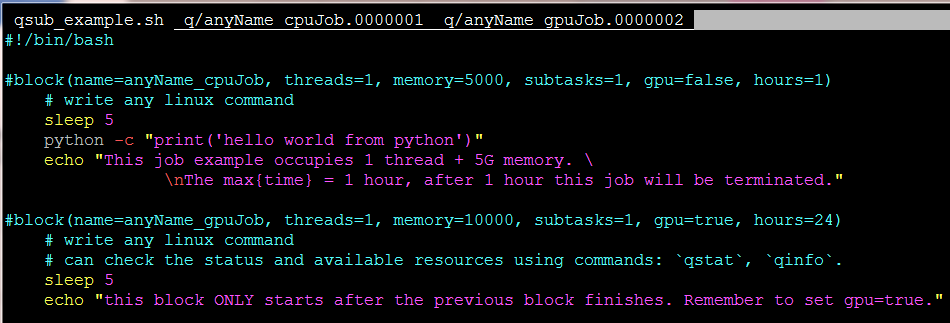
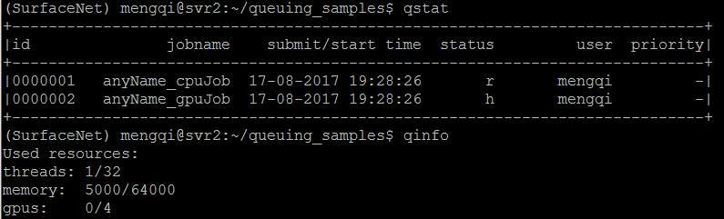
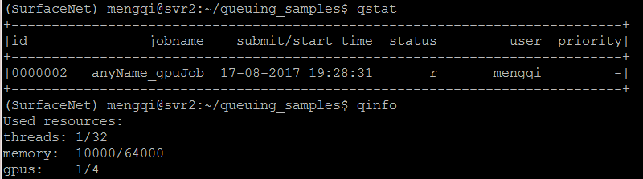
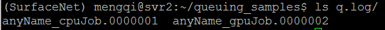
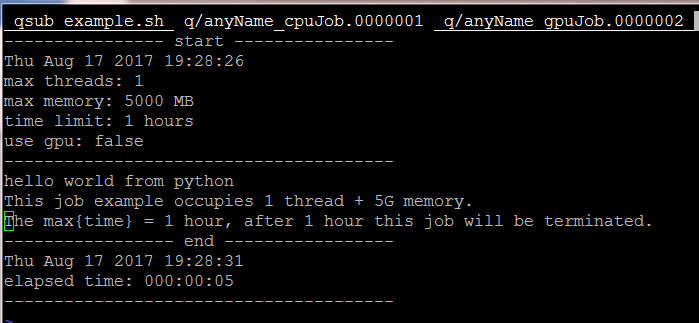
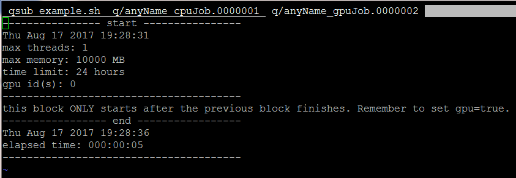

# Luvision  ;-)
* This repo includes some information only for luvision members. 
* [contribute]: If you want to open an account or to add more information to this doc, please contact Mengqi or directly pull a request. 

## content
* [Server and Fileserver](#Servers-and-fileserver), read before using the servers. 
* [Scheduling Tool](#Scheduling-Tool), read before running any code on the server.  
* [Reimbursement in TBSI](#Reimbursement-in-TBSI), 清华伯克利报销

## Servers and fileserver

* Keep in mind: 
    - **nerver** use luvision account to run code on the server. Please use **your own account and the queuing tool to submit jobs**. Otherwise, you may terminate someones’ running jobs. 
    - **luvision account is the only superuser**, and can only be used to install publicly used libraries, which may has different versions, such as cuda 7.0/8.0/…. Specify the version you want use in your local account `.bashrc` / `.theanorc` / … So that evryone’s setting will not affect others’. 
    - If you want to open an account or to add more information to this doc, please contact **Mengqi**.

* Access servers: 
    - `ssh <userName>@svr1.local`  # or svr2
        * if doesn't work --> use NAT IP address: `ssh <userName>@10.8.5.246`  # or 248 for sever 2 
    - Using **WLAN IP** to **access from outside of TBSI**: `ssh <userName>@58.250.23.197` # or 195 for server 2
    - open accounts: since the servers share the file system, please make sure the newly added users have the same userID and groupID on the servers. 
        * If you want to use both the servers and your local machin in TBSI, in order to make your life easier please make sure that your userID and groupID on your local machine are consistent with the ones on the servers.
    - Server arrangement

| name  | IP         | users                                 |
| ----- | ---------- | ------------------------------------- |
| svr1  | 10.8.5.246 | haitian    &      &            |
| svr2  | 10.8.5.248 | mengqi     & wangyong    &            |
| fsvr  | 10.8.5.233/206 | Nan                               |
| ----- | ---------- | ------------------------------------- |
| svr10 | 10.8.4.130 | lhanaf     &      &            |
| svr11 | 10.8.4.129 | wangyong   & chengwei    & wangdan    |
| svr12 | 10.8.4.132 | wangdan    & zhuyinheng  &            |
| svr13 | 10.8.4.133 | mengqi     & tanyang     &            |
| ----- | ---------- | ------------------------------------- | 
| svr20 | 10.8.4.140 | chengwei   & jinzhi      & tanyang    |
| svr21 | 10.8.4.141 | zhuyinheng & jinzhi      &            |
| svr22 | 10.8.4.142 | haitian    & yaping      & maoshi     |
| svr23 | 10.8.4.143 | lhanaf     & yaping      & zhengtian  |
| ----- | ---------- | ------------------------------------- | 
| svr40 | 10.8.5.225 | sebastian &    &     |
| svr41 | 10.8.5.234 |  &    &     |
| svr42 | 10.8.5.232 |  &    &     |

* Fileserver and local hard disk: 
    - Because of the security issue of the curlftpfs / samba / … , we only enable NFS on the fileserver. Don't enable other mount methods. 
    - The **/fileserver** folder is mounted from the fileserver, you can use that folder to share data between servers and your local machine. 
    - You'd better make a symbolic link in your home directory 
        * ~~`mkdir /fileserver/<userName>`~~ 
        * `ln -s /fileserver/<userName> /home/<userName>/fileserver`  # then you can access the fileserver using the address `~/fileserver`
        * The fileserver is large enough to do what you want. **Do not** put too large files in your home directory except `~/fileserver`.
    - 如果想在其它服务器访问svr1/2的文件服务器，只需要用sshfs的方式(见下文)挂载到你本地(svrxx or other machine on earth)就可以，然后做个symbolic link，让程序看起来都是同一个地址，在不同服务器跑也不用改程序。当然，还是建议直接挂载svrxx（除了1/2号）上本地的10T硬盘跑程序，贼快、稳定、给力！
    - local 10TB hard disk
        * 每个机器（svr1x, svr2x）有独立的10TB硬盘/hdd10T。贼快，大文件100+MB/s，而且比文件服务器安全一点（但是也要自己做好备份），建议经常跑任务、经常有小文件吞吐的用户瓜分一下每台服务器local的硬盘，这样可以降低文件服务器负荷，同时所有人的访问速度都会上来。如果想用的话，只需要发给我一个svr的编号，我会创建目录`svrxx:/hdd10T/<your_user_name>`。跨机器访问也很简单，通过sshfs挂载到你想远程访问的机器上(见下文).
    - Copy files from other PCs, example: `dingjian` wants to copy a file\folder in `anke`'s folder
        * Firstly, make sure `dingjian` has correct rights to read those `anke`'s files.
        * option 1: `scp -r dingjian@svrxx_ip:/home/anke/source_path /home/dingjian/destination_path`
        * option 2: `rsync -avh dingjian@svrxx_ip:/home/anke/source_path /home/dingjian/destination_path`

* mount remote folder (say, /home/mengqi/ on <IP>) 就像**优盘**一样，有了一个单独的文件夹，可以copy/paste/..., 
    - choose **ANY** way you prefer:
    - use GUI in Linux:
        * open a folder -> find 'Connect to Server' at left -> Server Address, like: `ssh://<userName>@<IP>`
    - over sshfs on your local machine (say, ~/remoteDir)
        - **Example**: want to mount the folder `svr23:/hdd10T` to `svr10:~/hdd`. Run these in **svr10**:
            - ~~`sudo apt-get install sshfs && sudo modprobe fuse`~~ # only run when `sshfs` command does not exist.
            - `mkdir ~/hdd` # make a mount point: 
            - `sshfs <userName>@<IP_of_svr23>:/hdd10T ~/hdd` # mount use sshfs
    - use [filezilla](https://filezilla-project.org/)
        * file -> site manager -> servertype (xxx ssh xxx) -> ip/username/passwd -> enter
    

* If you are still using Windows:
    - use sshfs on your OWN windows: [download](https://win-sshfs.googlecode.com/files/win-sshfs-0.0.1.5-setup.exe) (or download from the `<git_repo>/software` folder), and enter ssh information and the drive letter (say, G:) you would like Windows to use for your droplets file system
    - use [putty](https://the.earth.li/~sgtatham/putty/latest/w64/putty.exe) to ssh. use [pscp](https://the.earth.li/~sgtatham/putty/latest/w64/psftp.exe) to copy file between windows and Linux
    - or you'd better change to Linux.

## Basic tutorials
* [cuDNN without sudo (in your home folder)](https://github.com/mjiUST/driver_cuda_cudnn#cudnn-without-sudo-in-your-home-folder-2)
* basic tutorial of vim & tmux & zsh: [fast way to setup working environment (vim+tmux+zsh)](https://github.com/mjiUST/vim_tmux_zsh)
* conda:
    - download and install [miniconda](https://docs.conda.io/en/latest/miniconda.html) locally
        * `wget https://repo.continuum.io/miniconda/Miniconda3-latest-Linux-x86_64.sh`
        * `bash Miniconda3-latest-Linux-x86_64.sh`
    - create your own conda environment
        * `conda create --name <conda_name>`
    - activate / deactivate the conda environment
        * `conda activate <conda_name>`, `conda deactivate`
    - install packages
        * `conda install pytorch=1.0 torchvision=0.2.1 cudatoolkit=9.2 -c -y`  # example: pytorch with cuda
* `apt-get` without sudo 
    - `apt-get download tmux` # get the .deb file 
    - `ar x tmux*.deb` # extract the contents 
    - `tar xvzf data.tar.gz` # the file data.tar.gz has all the stuff which you need for executing the software 
    - `./usr/bin/tmux` # ./usr folder can be moved to other directory for convinience 
    - add `/home/<userName>/usr/bin/` to PATH, add to the end of `~/.bashrc` and source it. 
    - can directly use command tmux 
* frequently used command:
    - `ps -o user= <PID>`  # check who submitted the job <PID>

## Scheduling Tool
* Keep in mind:
    - nerver use luvision account to run code on the server. Please use your own account and this queuing tool to submit jobs. Otherwise, you may terminate some running jobs.
    - Should you have any queries, please contact Mengqi.

* About
    - we use it to schedule our jobs on the jointly used computers.
    - Jobs are scheduled according to a priority queue. The priority of a job is small if the amount of requested resources/computation time is large. Priority of a job increases with its waiting time. 
    - For the latest version and professional usage, please check the author’s [github](https://github.com/alexanderrichard/queueing-tool).
    - Check the samples in [<this_git_repo>/code/queuing_samples](https://bitbucket.org/mjiUST/luvision_userguide/src/master/code/queuing_samples/)
* Check the **available** resources:
    - `qinfo`:  

* How to submit jobs (`qsub xxx.sh`):
    - The queue uses bash scripts that are organized in blocks. A block is a part of the script that forms an independent job and can be specified as follows, in the file `qsub_example.sh`:

    - `qsub qsub_example.sh` to submit the jobs. Each task’s printout will be stored in the `./q.log` folder.
* How to check the status of the queued jobs:
    - `qstat`: check the current status of queued jobs on this machine. The output for the previous submitted job in the FIRST 5 seconds. **Note** that the anyName_gpuJob was in the `h: hold` status and there was no gpu occupied in the first 5 seconds. 

    - the status in the last 5 seconds:

* Check the log files
    - the name of the log files follow the `jobname`+`id`:

* Delete your jobs:
    - `qdel id1, id2, ...`

* Have fun!
 
 
## Reimbursement in TBSI

* 所有票据：
    - 每个票／说明上都需要签字（直接签在发票正面，不可用铅笔）
    - 大于一千的票：付款记录（最好有姓名／交易编号等信息）
    - 将名字／身份证／银行帐号／分行信息写到一张贴纸上（一份就好）

* 差旅相关：
    - 机票：行程单 + 信天游机票验伪截图并打印
    - 住宿：
    - 打车票
    - 其他票据（如携程邮寄发票的邮费差额发票）
    - 说明：（并签字）
        * 如机票不是闭环 或 没有住宿，必须写说明并签字
        * 列明各项花销：机票价格 / 住宿价格 / 打车费用 / 其他费用

* 实验器材／办公用具发票：
    - 抬头：~~清华-伯克利深圳学院筹备办公室~~  (recheck with **小武老师**!!!)
    - 纳税人识别号：~~1244030035002941X2~~  (recheck with **小武老师**!!!)
        * 地址：深圳市南山区学苑大道1001号南山智园
        * 电话：86244273
        * 开户行：建设银行深圳后海公馆支行
        * 账号：44201018600052503993
    - 需有购物清单
    - 电子发票打印亦可
    - 外币购买：需列出转换成人民币的汇率和金额 
